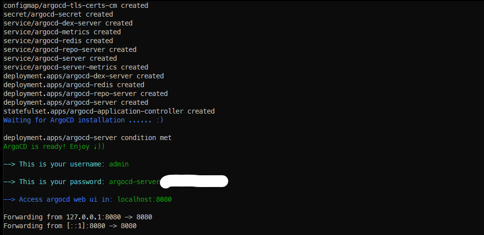
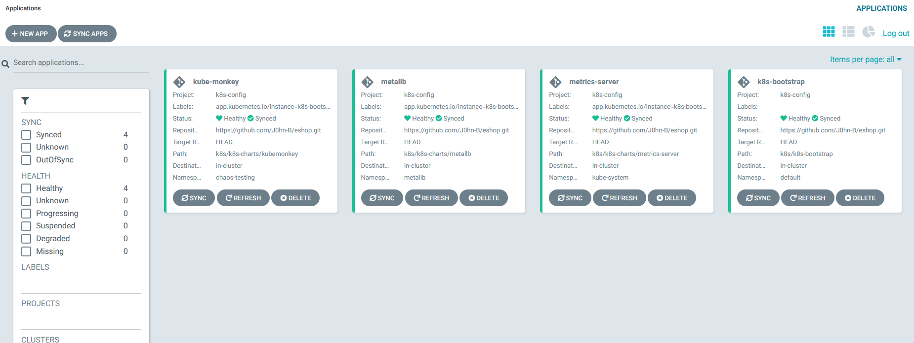

# GitOps K8s sample application deployment with ArgoCD

The app: <https://microservices-demo.github.io/>  

> Tested with Kind, an average of 16Gb of RAM required.

Architecture explained:  

- The application consists of 10 microservices. Each microservice is deployed with each own Helm chart.
- In a real world scenario, each microservice (code, Dockerfile, Helm Chart, etc..) lives in each own github repo.
- For simplicity in this demo, all application microservices charts are under the folder `services`

1) Clone the repo
2) Create a cluster with kind
3) Bootstrap the cluster
4) Deploy the application
5) kind delete cluster

## How to:  Cluster Bootstrap

`git clone https://github.com/J0hn-B/eshop.git`

`kind create cluster`  <https://kind.sigs.k8s.io/>

`cd ~/eshop/scripts` --> `chmod +x argocd_install.sh` --> `./argocd_install.sh`

From a second terminal: `cd /eshop/k8s` --> `kubectl apply -f argo_config`

Check your ArgoCD web UI, click **sync** in the k8s-bootstrap application (you may need to refresh your browser)  

In **k8s-bootstrap** chart, check the templates.  
In ArgoCD documetation this is described as "App of Apps" pattern
<https://argoproj.github.io/argo-cd/operator-manual/cluster-bootstrapping/>

## How to:  Application Deployment

`cd ~/eshop/app` --> `kubectl apply -f argo_config`  
Check your ArgoCD web UI, click **sync** in the **app-eshop** application (you may need to refresh your browser)

> Check the github action in .github/workflows/kind.yml.
